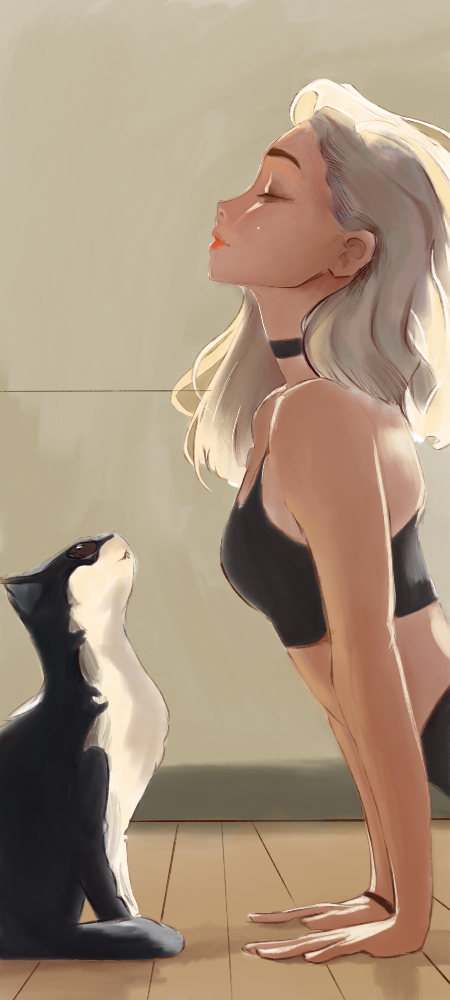

### Hi there 👋

### I'm BigBlackHat

* 💻 安服菜鸡、专业饮水机看守员、非知名黑客、常年内网迷路者、Web安全萌新

* 🐧 : ``NjIzNzEyNjEx``

* 🎮 王者农药、消逝的光芒、肝露谷物语、生化危机、狂战士信条、野炊、怪物猎人崛起  

* 🍜🍕🍟☕️🍗火龙果

* 还是个画渣，又菜又爱画

画廊[点击展开]

 
 
 

<!-- 

 -->

<!--
**bigblackhat/bigblackhat** is a ✨ _special_ ✨ repository because its `README.md` (this file) appears on your GitHub profile.

Here are some ideas to get you started:

- 🔭 I’m currently working on ...
- 🌱 I’m currently learning ...
- 👯 I’m looking to collaborate on ...
- 🤔 I’m looking for help with ...
- 💬 Ask me about ...
- 📫 How to reach me: ...
- 😄 Pronouns: ...
- ⚡ Fun fact: ...
-->
